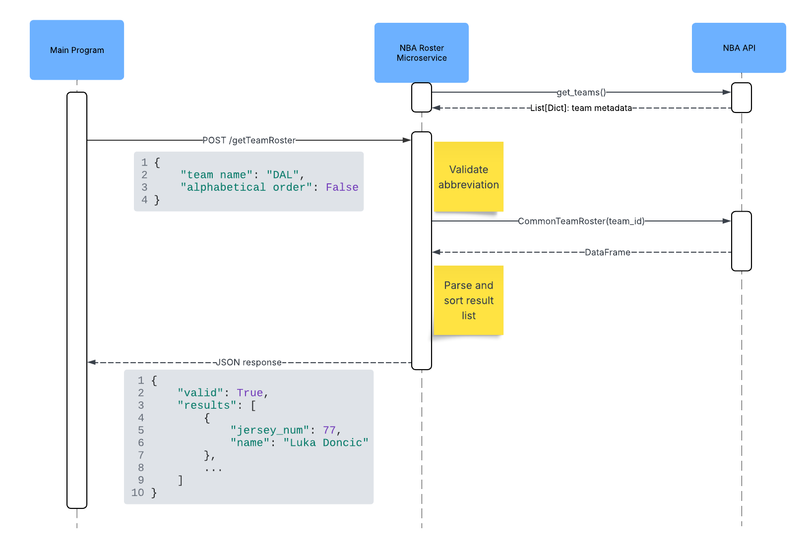

# ReadMe

This microservice provides NBA roster data based on a team abbreviation and a sorting flag. 
It responds with player names and jersey numbers in either alphabetical or jersey number order.

### Requirements and Setup

To run this microservice, your environment must have the following:

- Python 3.8 or higher
- Flask
- nba_api

### Step 1: Clone the Repository

```bash
git clone https://github.com/putschej/361assignment8.git
cd 361assignment8
```

### Step 2: Install Dependencies

```bash
pip install -r requirements.txt
```

All required dependencies are listed in `requirements.txt`. If needed, you may also install the core packages manually:

```bash
pip install flask nba_api
```

### Step 3: Run the Microservice

```bash
python app.py
```

The Flask server will start on `http://localhost:5000`.

## How to REQUEST Data

To request data from this microservice, your main program must send a POST request to `/getTeamRoster` with a properly formatted JSON body.

### Required Fields in REQUEST Body:

| Field                | Type    | Description                                                  |
| -------------------- | ------- | ------------------------------------------------------------ |
| `team name`          | string  | A valid 3-letter NBA team abbreviation (example: `"DAL"`)    |
| `alphabetical order` | boolean | If `True`, player names are sorted alphabetically.  If `False`, player names are sorted by jersey number. |

### Example Python Call Using `requests`

```python
import requests

url = "http://localhost:5000/getTeamRoster"
payload = {
    "team name": "DAL",
    "alphabetical order": False
}

response = requests.post(url, json=payload)
```

## How to RECEIVE data

The microservice will return a JSON object with two fields:

| Field     | Type    | Description                                                 |
| --------- | ------- | ----------------------------------------------------------- |
| `valid`   | boolean | `True` if team exists; else `False`.                        |
| `results` | list    | A list of players if `valid` is `True`, else an empty list. |

### Example of how to process the RESPONSE

```python
import json

if response.status_code == 200:
    data = response.json()
    if data["valid"]:
        for player in data["results"]:
            print(f"{player['jersey_num']}: {player['name']}")
    else:
        print("Invalid team abbreviation.")
else:
    print("Request failed with status", response.status_code)
```

## UML Sequence Diagram


